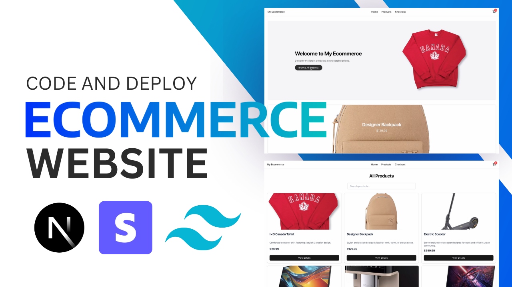

# Full‑Stack Ecommerce Platform Tutorial

<div align="center">
  <br />
  <a href="https://youtu.be/DLeAPn5-TIA" target="_blank">
    
  </a>
  <br />
  <div>
    
    
    
    
    
  </div>
  <h3 align="center">Build a Modern Ecommerce Platform</h3>
  <div align="center">
    Follow along with our detailed tutorial on 
    <a href="https://youtu.be/YOUR_VIDEO_LINK" target="_blank"><b>YouTube</b></a>
  </div>
  <br />
</div>

## 📋 Table of Contents

1. [Introduction](#introduction)
2. [Tech Stack](#tech-stack)
3. [Features](#features)
4. [Quick Start](#quick-start)
5. [Code Snippets](#code-snippets)
6. [Assets & More](#assets--more)

## 🚀 Introduction

In this video tutorial, you'll learn how to build a fully functional ecommerce platform using modern web technologies such as Next.js 15, Tailwind CSS v4, Stripe for payments, and Zustand for state management. This project focuses on building a sleek, responsive frontend with a secure payment flow—without using a backend database like Prisma, Postgres, or Neon.

Watch the tutorial on [YouTube](https://youtu.be/YOUR_VIDEO_LINK).

## ⚙️ Tech Stack

- **Next.js 15** – For server components and modern routing
- **Tailwind CSS v4** – For rapid, responsive styling using a CSS‑first configuration
- **TypeScript** – For type safety and modern JavaScript features
- **Stripe** – For product management and payment processing
- **Zustand** – For lightweight client‑side state management

## ⚡️ Features

- **Dynamic Product Carousel:**  
  A landing page featuring an auto‑cycling carousel that showcases your top products.

- **Responsive Product Pages:**  
  Detailed pages with interactive plus/minus buttons to adjust item quantities in the cart.

- **Real‑Time Cart State:**  
  A live-updating cart icon in the navbar using Zustand.

- **Seamless Stripe Checkout:**  
  A secure checkout process powered by Stripe's API.

- **Modern UI:**  
  A sleek, professional design built with Tailwind CSS v4 and shadcn‑inspired UI components.

## 👌 Quick Start

### Prerequisites

- [Git](https://git-scm.com/)
- [Node.js](https://nodejs.org/en/)
- [npm](https://www.npmjs.com/)

### Cloning the Repository

Run the following commands in your terminal:

```bash
git clone https://github.com/ronniee7/your-ecommerce-repo.git
cd your-ecommerce-repo
